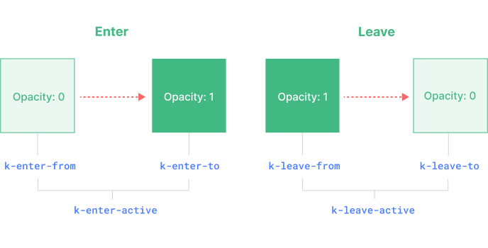

<script setup>
import Basic from './transition-demos/Basic.kdu'
import SlideFade from './transition-demos/SlideFade.kdu'
import CssAnimation from './transition-demos/CssAnimation.kdu'
import NestedTransitions from './transition-demos/NestedTransitions.kdu'
import JsHooks from './transition-demos/JsHooks.kdu'
import BetweenElements from './transition-demos/BetweenElements.kdu'
import BetweenComponents from './transition-demos/BetweenComponents.kdu'
</script>

# Transition

Kdu offers two built-in components that can help work with transitions and animations in response to changing state:

- `<Transition>` for applying animations when an element or component is entering and leaving the DOM. This is covered on this page.

- `<TransitionGroup>` for applying animations when an element or component is inserted into, removed from, or moved within a `k-for` list. This is covered in [the next chapter](/guide/built-ins/transition-group.html).

Aside from these two components, we can also apply animations in Kdu using other techniques such as toggling CSS classes or state-driven animations via style bindings. These additional techniques are covered in the [Animation Techniques](/guide/extras/animation.html) chapter.

## The `<Transition>` Component

`<Transition>` is a built-in component: this means it is available in any component's template without having to register it. It can be used to apply enter and leave animations on elements or components passed to it via its default slot. The enter or leave can be triggered by one of the following:

- Conditional rendering via `k-if`
- Conditional display via `k-show`
- Dynamic components toggling via the `<component>` special element

This is an example of the most basic usage:

```kdu-html
<button @click="show = !show">Toggle</button>
<Transition>
  <p k-if="show">hello</p>
</Transition>
```

```css
/* we will explain what these classes do next! */
.k-enter-active,
.k-leave-active {
  transition: opacity 0.5s ease;
}

.k-enter-from,
.k-leave-to {
  opacity: 0;
}
```

<Basic />

<div class="composition-api">

[Try it in the Playground](https://kdujs-sfc.web.app/#eNpVkcFuwjAMhl/Fy4VNoimXXbqCtnfgmEvoXAhNkyhxQQj13eeQCrFT8v/2/8Vy7uInBDn8TqIRbeqiCQQJaQo75cwYfCS4Q8QeZuijH2HFrSvllOu8S9x68lfY5oZ3ihN+KNfWhcJ5FoRjsJqQFUB7mIi8g+/Omm7YKrGk3/KpxG7vj0eLbV3aSmQftUuGzKLZCTBUpl/SnDqhtb6t88Bcrf8F2vplAJaJbjZf5VChI4yV7shccP1wLOoLLg7cM42erAZ80J2hG2zkZwLUCb+UmzP0ycr7eSWRL5Ql2cCmRHhDjzHEWpQNV6MO8py84z94JNRSSEo0hZE93nzWSpyIQmrqmo1zqlLfySsepA4hOzJOjsyIEtNYHaK/JowMVyJj+PVZzH9wx65u)

</div>
<div class="options-api">

[Try it in the Playground](https://kdujs-sfc.web.app/#eNpVUctuwyAQ/JUtp1aKIZdeXCdq/yFHLsRZJ8QYEKyTRlH+vWCcyJUQ7Aw7o33c2Y/3vD+MrGZNbIP2tJUWf70LBAfs1GgI7tICHBSp948SAwSkMdgnAognd62BwoiFeeQnXek04uWbAOHgjSJMCKDZj0TOwndrdNtvJMs2sIG3/Eq23bnj0WAjSlqR7IKyUZOecWI89JXuZnVSndAY1whf8sU/QSMWBSQY6WZyyPsKLWGoVEv6gquJMaguODOlVXp51eC8ajXdYM0/I6CK+DW1u/DqghuWTuSKy6ysYV0kaUJTGWzF9JAnXw3K83N0Nm1lUsj5I0pWP4cuWVpbxpKdiHyshUjEOVaxa/kV91x5nxkeRkt6QI5xqPbBXSOGZC7Zc0Xs8Qe8DrJR)

</div>

:::tip
`<Transition>` only supports a single element or component as its slot content. If the content is a component, the component must also have only one single root element.
:::

When an element in a `<Transition>` component is inserted or removed, this is what happens:

1. Kdu will automatically sniff whether the target element has CSS transitions or animations applied. If it does, a number of [CSS transition classes](#transition-classes) will be added / removed at appropriate timings.

2. If there are listeners for [JavaScript hooks](#javascript-hooks), these hooks will be called at appropriate timings.

3. If no CSS transitions / animations are detected and no JavaScript hooks are provided, the DOM operations for insertion and/or removal will be executed on the browser's next animation frame.

## CSS-Based Transitions

### Transition Classes

There are six classes applied for enter / leave transitions.



1. `k-enter-from`: Starting state for enter. Added before the element is inserted, removed one frame after the element is inserted.

2. `k-enter-active`: Active state for enter. Applied during the entire entering phase. Added before the element is inserted, removed when the transition/animation finishes. This class can be used to define the duration, delay and easing curve for the entering transition.

3. `k-enter-to`: Ending state for enter. Added one frame after the element is inserted (at the same time `k-enter-from` is removed), removed when the transition/animation finishes.

4. `k-leave-from`: Starting state for leave. Added immediately when a leaving transition is triggered, removed after one frame.

5. `k-leave-active`: Active state for leave. Applied during the entire leaving phase. Added immediately when a leave transition is triggered, removed when the transition/animation finishes. This class can be used to define the duration, delay and easing curve for the leaving transition.

6. `k-leave-to`: Ending state for leave. Added one frame after a leaving transition is triggered (at the same time `k-leave-from` is removed), removed when the transition/animation finishes.

`k-enter-active` and `k-leave-active` give us the ability to specify different easing curves for enter / leave transitions, which we'll see an example of in the following sections.

### Named Transitions

A transition can be named via the `name` prop:

```kdu-html
<Transition name="fade">
  ...
</Transition>
```

For a named transition, its transition classes will be prefixed with its name instead of `k`. For example, the applied class for the above transition will be `fade-enter-active` instead of `k-enter-active`. The CSS for the fade transition should look like this:

```css
.fade-enter-active,
.fade-leave-active {
  transition: opacity 0.5s ease;
}

.fade-enter-from,
.fade-leave-to {
  opacity: 0;
}
```

### CSS Transitions

`<Transition>` is most commonly used in combination with [native CSS transitions](https://developer.mozilla.org/en-US/docs/Web/CSS/CSS_Transitions/Using_CSS_transitions), as seen in the basic example above. The `transition` CSS property is a shorthand that allows us to specify multiple aspects of a transition, including properties that should be animated, duration of the transition, and [easing curves](https://developer.mozilla.org/en-US/docs/Web/CSS/easing-function).

Here is a more advanced example that transitions multiple properties, with different durations and easing curves for enter and leave:

```kdu-html
<Transition name="slide-fade">
  <p k-if="show">hello</p>
</Transition>
```

```css
/*
  Enter and leave animations can use different
  durations and timing functions.
*/
.slide-fade-enter-active {
  transition: all 0.3s ease-out;
}

.slide-fade-leave-active {
  transition: all 0.8s cubic-bezier(1, 0.5, 0.8, 1);
}

.slide-fade-enter-from,
.slide-fade-leave-to {
  transform: translateX(20px);
  opacity: 0;
}
```

<SlideFade />

<div class="composition-api">

[Try it in the Playground](https://kdujs-sfc.web.app/#eNqFks9u2zAMxl+F06UpFtnphgGF5xbbZS+wHnbQRVboRo0sCRLdrAvy7iPrYM2hwC6S+Onjj/rDo/qec7PfzqpTfXXFZ4KKNOd7E/2UUyE4QsERTjCWNMEVW69MNNGlWNm6Swe4E8OKyozXJvbtQuF8DginHCyhRNQPM1GK8M0F7/Z3Rp2zP8hs1P1DenwMCD+D3yJ8hB92i3275HA+QP9QbKyePDOinVAI4tUjOzlfPOzKsNd+PONZ3mEIqW/lRrzbvkFY6NvLE8a+0kuQZfMG1hgJi7aO/DPCUSD0D9GBDQE2zecKaCvqNNNXE0/CukQEtM/4H8RtBTcP3ukB/3gsq5s1i19kuF3DzfV72OVk8i/r9+pRuqg1pjJ1y1Ku+2v1aZN/CxUgZes8vXSwWYrwF74+g1qrpQX0ZHPzVFPkJnklmvNGNapbaojGrSGxUTuiXLu2ZeGp6jq65oBDY3MWpSlzJD9hg3XSQ0mHioXhRgmGq5/U6S+PMuSd)

</div>
<div class="options-api">

[Try it in the Playground](https://kdujs-sfc.web.app/#eNqFks1OwzAMx1/F5DTE0g4QEioBwYUXgAOHXNLWZWFpEiUuA6a9O8m6L6RJSFVi/xv/7DhesSfvi0U7sIqJ2ATt6UFa/PIuELTYqcEQrKQFaBWpyfloAwSkIdidBxDnblkBhQFHZZ23tKRPlHtucgh7bxRh9kjUA5Gz8NgY3SzuJcsYuIezvEv28Ore3w3Ci9EtwgU8qxZFOcakeADxGpSNmnRiWNVjJuSzvEsnU/xYi/Cw4Lrb4pM8R2OcKP3IKA+QJIjyuEIrIn2bbBYHMEdLGLhqSH/i2ALaIypQxsCsuI6AKiJ3A91t2vAXYVB94j+I2wjNUOuG1/ijMUwup0m8ycvtFC7PT2HHyrrg+umpfOSOcnUu9PnJkpmv+za5mvmvTAVwXjWaviuYjUnSE27awKZM93k0eK988RGdTWOzIcrtjyhZtZsKydJcZV+yOZGPVVkm4SPy2DXFEutCeZ+VIgyWdI8Fxp7XwS0jhgSXbDdDbP0LTGnogA==)

</div>

### CSS Animations

[Native CSS animations](https://developer.mozilla.org/en-US/docs/Web/CSS/CSS_Animations/Using_CSS_animations) are applied in the same way as CSS transitions, with the difference being that `*-enter-from` is not removed immediately after the element is inserted, but on an `animationend` event.

For most CSS animations, we can simply declare them under the `*-enter-active` and `*-leave-active` classes. Here's an example:

```kdu-html
<Transition name="bounce">
  <p k-if="show" style="text-align: center;">
    Hello here is some bouncy text!
  </p>
</Transition>
```

```css
.bounce-enter-active {
  animation: bounce-in 0.5s;
}
.bounce-leave-active {
  animation: bounce-in 0.5s reverse;
}
@keyframes bounce-in {
  0% {
    transform: scale(0);
  }
  50% {
    transform: scale(1.25);
  }
  100% {
    transform: scale(1);
  }
}
```

<CssAnimation />

<div class="composition-api">

[Try it in the Playground](https://kdujs-sfc.web.app/#eNqNkstO6zAQhl9lsHQESCcXkLpJA4IdD8DSG9dMWlPfZE9aqqrvzjgp0BVCiuR4/P3/jMdzFM8x1tu3UXSizzqZSJCRxvgovXExJIIjJBzgBEMKDq4ZvZZeeh18ZnQT9vBQgBtKI95K3zezC+t5Q+iiVYRlR/1qJAoenrQ1evsgxVl9VVYpHl/Dem2xb2aMJQD9a1I+GzIs88ohi1Zh9BoZL+dMRNhWZji7SQGZDrZwTqW18RWF2MF9Gz+WQPhBlbJm7TvQ6AnT8tsG4AWtDbDBhGAy5OAQplSHSXd1ztaUxpT1pzAO9M3lRX0/1cC/9VxsNSWrlCazQzgWA8XdVUXdzVmwMh7aepGX0p9+hBbVDv8m5EfYYco4Gzxt8TAk7li+wCaD9t+8AlC5whCS6yBrZfGmvWUxAMsBFr9wd/X94gK9a39jv0H+eDimzoj/Yh6uyqlYv+fgefwmB3k+yFJ0X55S8NCVvRQbopi7puHAe67yoOs9rmoVY4nUafRkHNaYXbVKYZ8xsbkUXwWI0yfHXP82)

</div>
<div class="options-api">

[Try it in the Playground](https://kdujs-sfc.web.app/#eNqNUttOwzAM/RUTCQkkmhakvXQFwRsfwGNess7dwnJT4u4ixL+TNOvYE0KKktg559ix/cXevOe79cha1sU+KE8vwuLRu0CwxkGOmuBLWIC1JHl3X+4AAWkMdrYA4tYdWqAwYvF85yNtaXX1RTcZhMZrSZgt6lYjkbPw2mvV754FyzLwDDf5FOzlw202Gru6wBIFoPsI0kZFKtGsNJhIKzfaHhO8hO487Co1nNUEg0gnnXFGho2yFTnfwlPjj0sgPFIltdrYFnq0hGF5kQF4R60dbDEgqAjRGYQp1Gni3Zyj1b7kVf8mlhxdff1R2005pCsvyVZTsEr2pPZYqiitMjKz2xIFK2Wh4Yu4nKo4EzXKPf6PmJq0xxCxCLzu8DSEVLF4BZsEmtu5j5S/MLhgWoi91HjX3CfyuZuLP3CP/GlxBX1s/sJegGU4psqwB6ZMHrrKSM8/o7NpICcFcX6IgrWzpmBpYrMt2JbIx7auk+MzVnHo+QFXXHqfPTyMlpRBjtFUq+AOEUMSF2xOgH3/AOJwAyg=)

</div>

### Custom Transition Classes

You can also specify custom transition classes by passing the following props to `<Transition>`:

- `enter-from-class`
- `enter-active-class`
- `enter-to-class`
- `leave-from-class`
- `leave-active-class`
- `leave-to-class`

These will override the conventional class names. This is especially useful when you want to combine Kdu's transition system with an existing CSS animation library, such as [Animate.css](https://daneden.github.io/animate.css/):

```kdu-html
<!-- assuming Animate.css is included on the page -->
<Transition
  name="custom-classes"
  enter-active-class="animate__animated animate__tada"
  leave-active-class="animate__animated animate__bounceOutRight"
>
  <p k-if="show">hello</p>
</Transition>
```

<div class="composition-api">

[Try it in the Playground](https://kdujs-sfc.web.app/#eNqNUk1vGyEQ/SuUS1qpC4rUk7uJ0l9QqcoRKWLZWRubLzFD3cryf+/g3SY5hgvMm/eGNwMX+aMUdZqb3MkRXfWFBAK18miSjyVXEhdRYRFXsdQcxR1T70wyyeWETD3ks3johM9UG3wxadRrFdZzQBBLsAQ9onFqRDmJJxe8Oz0Yuak/9d3Ix+e83wcY9UpjiRDjc7UJPfnM1QSvZCOw0jWkHAcXLCKgkWsSEkEdrCP/G9YcUy33wQ5eXrbDLF4RsrP9rw1gWfRx7ZRbcvCz0S+/P9Ba5WaZTRdxGvyyNciNHSCEPOo+U87qt54YGPX7GaUR6W/ox6dt+kYeiArutHZzOqJyIbd5CbaCcjlqe7R/dPAT6s2Zcoj6m7pX969I9KmjRn6/Pc/tAvlVrhcM0RZ1xJz4A1y6P7MlmL8TN6Rj/Ow9fnPDwBEHXJw6w6RsKR1RtSXyERRgHKaazwiVi6/TuZp0ldd/8ovcAQ==)

</div>
<div class="options-api">

[Try it in the Playground](https://kdujs-sfc.web.app/#eNqNUttOAyEQ/RXkSRMXYuJTXY1+gYnxkcSw7LSl5RZmsBrjvwtLW300ITBz5naGmS/+lJLYz4Wv+Igm20QPKsBHipnYDGtdHLEvFRibNenLqy4zloFKDieNMdzGw4pRLtCR7/bUq55RnvNWhcAnpwmaRuNUiGJgj8ZZs79XvKVh9+yivYo/vMbNxsEou1sNYWx8zTqgJRtrtlYpaA810hSk6AfjNCKg4t0IgSAP2pB9h26rrjpYXxm8vR2FmZ0R0rM+xTrQNej/sVMswcBzoRe72VLPslCupBPbD3Z9bLA2tgXn4ihTb0n+9lSBUf79ozAifbomPlq/TEXxLVHClZRmDjsUxsUyr53OIEz0Uu/0h3R2QnlkJgyivBU34uaMeBsaqvjdMp6lAL/mvcDgdRI7jKGuxDJfdTRU/9Vp4orXnWn6L5sK7HDAtREHmIROqSEil0DWgwD0w5TjASHX5P132n7w7x8j1t/k)

</div>

### Using Transitions and Animations Together

Kdu needs to attach event listeners in order to know when a transition has ended. It can either be `transitionend` or `animationend`, depending on the type of CSS rules applied. If you are only using one or the other, Kdu can automatically detect the correct type.

However, in some cases you may want to have both on the same element, for example having a CSS animation triggered by Kdu, along with a CSS transition effect on hover. In these cases, you will have to explicitly declare the type you want Kdu to care about by passing the `type` prop, with a value of either `animation` or `transition`:

```kdu-html
<Transition type="animation">...</Transition>
```

### Nested Transitions and Explicit Transition Durations

Although the transition classes are only applied to the direct child element in `<Transition>`, we can transition nested elements using nested CSS selectors:

```kdu-html
<Transition name="nested">
  <div k-if="show" class="outer">
    <div class="inner">
      Hello
    </div>
  </div>
</Transition>
```

```css
/* rules that target nested elements */
.nested-enter-active .inner,
.nested-leave-active .inner {
  transition: all 0.3s ease-in-out;
}

.nested-enter-from .inner,
.nested-leave-to .inner {
  transform: translateX(30px);
  opacity: 0;
}

/* ... other necessary CSS omitted */
```

We can even add a transition delay to the nested element on enter, which creates a staggered enter animation sequence:

```css{3}
/* delay enter of nested element for staggered effect */
.nested-enter-active .inner {
  transition-delay: 0.25s;
}
```

However, this creates a small issue. By default, the `<Transition>` component attempts to automatically figure out when the transition has finished by listening to the **first** `transitionend` or `animationend` event on the root transition element. With a nested transition, the desired behavior should be waiting until the transitions of all inner elements have finished.

In such cases you can specify an explicit transition duration (in milliseconds) using the `duration` prop on the `<transition>` component. The total duration should match the delay plus transition duration of the inner element:

```kdu-html
<Transition :duration="550">...</Transition>
```

<NestedTransitions />

[Try it in the Playground](https://kdujs-sfc.web.app/#eNqVVMtu2zAQ/JWtesijkeQ0SIGoTtCil3xADi2gC02tLMYUSZBUnMDwv3dJyrbstmgLGzC5j5nZIc1N9tWYYtUMWZXNHbfCeHDoB/NQK9EbbT1swGILW2it7uGMSs9qVSuulaPSTq/hPhScezvgRa3mZUKhftp47I1kHmkHMF8M3msFX7gUfHVfZ2P3u/BbZw9PermUOC9TWWp5skw54QW1NYNlYUGNt7ezOgPFeqSNQuexof7QQC2NeIFVLtqRgAq5ZM7RVg8e7b5wLN0lhVKHZO3D5xGl1Pvikqp3HPv1vDwopMC8nExMW+ffZFgWkfoKisgCG0r6BeOrpdWDaip4j4ifA55hTSPUsoKbmXmNkV6ovEOx7HwF17MU3YYEoY5otAQ4guOcT8qSQzkq0pAz7sULkpQxKpG94BhNwvx+ogqYlDArbhwgc5iTFBokIZeX0KBkbxABQLek3RIFoMQ+/F6WB+pTEoADSR5hKqL5eOsS9qnmcPWuTtG8niC12vZVWgb3f5wH/y6igdowLnwg2IGT9DUCZ4rGc3oiBRLBbgQHg6PD2EUdhbnX1h2NNnV1PN9fpB5lx/P6T5cjTXD5WOLfpJye6D+a/adByPMD7u+t/z6xvryMN9A/0t0EFi8nMPjWEQPC3SdYDEsQCjqmGjkxejyxiUWuSH+8p044oK/SnoqxoWLq174jRQur1w7pdLTdU9x9gDXlEKgisCWUjjlYICpoxSs2ETrYOL0qxWx2neyhBy3+ibOrLD2Iec9M8ey0oiczukBvR0y4OquSLyFGD2XY11nnvXFVWVLg2eWu5cUaFwUzJkQKOygveizQ9fk4AYHXWYAh9m22/QlnLvQl)

If necessary, you can also specify separate values for enter and leave durations using an object:

```kdu-html
<Transition :duration="{ enter: 500, leave: 800 }">...</Transition>
```

### Performance Considerations

You may notice that the animations shown above are mostly using properties like `transform` and `opacity`. These properties are efficient to animate because:

1. They do not affect the document layout during the animation, so they do not trigger expensive CSS layout calculation on every animation frame.

2. Most modern browsers can leverage GPU hardware acceleration when animating `transform`.

In comparison, properties like `height` or `margin` will trigger CSS layout, so they are much more expensive to animate, and should be used with caution. We can check resources like [CSS-Triggers](https://csstriggers.com/) to see which properties will trigger layout if we animate them.

## JavaScript Hooks

You can hook into the transition process with JavaScript by listening to events on the `<Transition>` component:

```html
<Transition
  @before-enter="onBeforeEnter"
  @enter="onEnter"
  @after-enter="onAfterEnter"
  @enter-cancelled="onEnterCancelled"
  @before-leave="onBeforeLeave"
  @leave="onLeave"
  @after-leave="onAfterLeave"
  @leave-cancelled="onLeaveCancelled"
>
  <!-- ... -->
</Transition>
```

<div class="composition-api">

```js
// called before the element is inserted into the DOM.
// use this to set the "enter-from" state of the element
function onBeforeEnter(el) {}

// called one frame after the element is inserted.
// use this to start the entering animation.
function onEnter(el, done) {
  // call the done callback to indicate transition end
  // optional if used in combination with CSS
  done()
}

// called when the enter transition has finished.
function onAfterEnter(el) {}
function onEnterCancelled(el) {}

// called before the leave hook.
// Most of the time, you should just use the leave hook
function onBeforeLeave(el) {}

// called when the leave transition starts.
// use this to start the leaving animation.
function onLeave(el, done) {
  // call the done callback to indicate transition end
  // optional if used in combination with CSS
  done()
}

// called when the leave transition has finished and the
// element has been removed from the DOM.
function onAfterLeave(el) {}

// only available with k-show transitions
function onLeaveCancelled(el) {}
```

</div>
<div class="options-api">

```js
export default {
  // ...
  methods: {
    // called before the element is inserted into the DOM.
    // use this to set the "enter-from" state of the element
    onBeforeEnter(el) {},

    // called one frame after the element is inserted.
    // use this to start the animation.
    onEnter(el, done) {
      // call the done callback to indicate transition end
      // optional if used in combination with CSS
      done()
    },

    // called when the enter transition has finished.
    onAfterEnter(el) {},
    onEnterCancelled(el) {},

    // called before the leave hook.
    // Most of the time, you shoud just use the leave hook.
    onBeforeLeave(el) {},

    // called when the leave transition starts.
    // use this to start the leaving animation.
    onLeave(el, done) {
      // call the done callback to indicate transition end
      // optional if used in combination with CSS
      done()
    },

    // called when the leave transition has finished and the
    // element has been removed from the DOM.
    onAfterLeave(el) {},

    // only available with k-show transitions
    onLeaveCancelled(el) {}
  }
}
```

</div>

These hooks can be used in combination with CSS transitions / animations or on their own.

When using JavaScript-only transitions, it is usually a good idea to add the `:css="false"` prop. This explicitly tells Kdu to skip auto CSS transition detection. Aside from being slightly more performant, this also prevents CSS rules from accidentally interfering with the transition:

```kdu-html{3}
<Transition
  ...
  :css="false"
>
  ...
</Transition>
```

With `:css="false"`, we are also fully responsible for controlling when the transition ends. In this case, the `done` callbacks are required for the `@enter` and `@leave` hooks. Otherwise, the hooks will be called synchronously and the transition will finish immediately.

Here's a demo using the [GreenSock library](https://greensock.com/) to perform the animations. You can, of course, use any other animation library you want, for example [Anime.js](https://animejs.com/) or [Motion One](https://motion.dev/).

<JsHooks />

<div class="composition-api">

[Try it in the Playground](https://kdujs-sfc.web.app/#eNqNVNtu1DAQ/ZXBCG0rbS5tqRBhWwqINyRe+gBSXhxnknU3sS3b6baq9t8Z50KTIi19SubM5Zy5yE/sizHxruxYxjZOWGk8OPSduc6VbI22Hp7AYgUHqKxuYUWhq7+u2nEz4uGXHLkSWjmqsdV7uAqZJ952eBo8VaeEl1qBVl+x0ha/K4/2BJtTeMoV9NViIidkPSAATvAGf2WQxueX6xn0ewFpw4X0jxmcBftAbIfws6CcyNZQaoVzSq/njGVneUihYnNC0rCwScBkP7OPAHKHGayw4c5LEUv1s/Mn5/HlGs5OV1OS+qZb06CnyCBoJnwh+wfye1zKzv1R2Wn84ZXCHzK4SNPXiJ7U/WditJKxWkl1aCIp5b8Y0sR3ZACbZLhEukEyPFIY90gWwKbovKfB3IhGit1VzsZDexO+Obu+1XXd4CYZwvoClHRruXIyaBy4b4r+/iIMN0FFFgeZszHo2bvEm7CSHu+XM+GZcI7QijduxHrFRF/KexA01+AO84sK/ZAz2EWyGjsg5ZuEwoYek2e9BGyS2QTIdP6xCb/xVGrYQ8HFrra6U2UGb9ML/rF6/yngLbe1VJHXJoPz1Dz04F6Wfhu2P9pblPXWz4BC2xJtZHkpO5fBZfqO4GE1Iz1bs+EViFq6iDunFT0hvZJ8dLicZdONDI0HIGdb743LkqRTZlfHQrdJ8H1uddk1NLnxPnJGT80ygYA7F7lKxHssYm5MQGLbKS9bjNG1UWH13qElOcs6CYH3oR9U1FbY5fG6L8L/qd0fKw2EHf4AZwq34w==)

</div>
<div class="options-api">

[Try it in the Playground](https://kdujs-sfc.web.app/#eNqNVE1P3DAQ/SvTVNWCtPkAiqqmC6WteqvUC4dW8sWbTHbNJnZkT9hFiP/esZNAQiVAWm0yz+N5z28mvo++tW2yK7soj1ausKqlS6FV0xpLsHGyhcqaBhb+dSE0gNB4CIslVrKrCe49WkqSR8f9O4BF6qweIwC3NfscyHbYIw/+8bD0/w3S1pQu98mCBBn9HStj8acmtCEDwOh59AvlbajEdfgndNXpgpTRvDbZfYT1oMiLTxwSI8tRlStkjX9yyJLT86FygP7OINPKQtFdDieB7zgQehMmlCPZEkqjcUpJZspYdlb6LVxsSsgaZjELGOMn9gFA6TCHBdbSkSoSpX93dHSanC/h5Hjx6M8P07Q1Emd6QRPhM9nBxblsQS/KzpJPbxR+yOEsy94ielT3imPckqFayXXYkYz3PzNp5HvBgFX6OOIcEHKaJOQIYLXuiKcPropaFbsLEfmhhQt4558iurw2m02Nq7RPCwV407WV2imvsee+Wof5i9HPBBeZDaSIhqSn1Tle+5YEvB/xAc8L5xitZO0GLChm+lLdQsG++mXvX7w2BxHBLlbVcAJWvko5rT9j+qSXgVU6cYBDR3e1f03GUn0f1rLYbazpdJnD++xMfq4+fgmfrrQbpWMybQ6nWXsI4F6VtPXdH+Itqs2WJsDa2BJtbGWpOv7sz7MPDPetGeijZdTfP3HDE3HjjOa7KSgRw4ITUbgwvAf9wT0goi1R6/I07XS72ySFaVK/9rUxZVezc8N8iIivu/kGBm5c7Koi2eM6kW3rkcR2mlSDCbomXluzd2hZzrxOyuCtPw9qPpbv5ct1n6X/V3u81qKHf2ou038=)

</div>

## Reusable Transitions

Transitions can be reused through Kdu's component system. To create a reusable transition, we can create a component that wraps the `<Transition>` component and passes down the slot content:

```kdu{5}
<!-- MyTransition.kdu -->
<script>
// JavaScript hooks logic...
</script>

<template>
  <!-- wrap the built-in Transition component -->
  <Transition
    name="my-transition"
    @enter="onEnter"
    @leave="onLeave">
    <slot></slot> <!-- pass down slot content -->
  </Transition>
</template>

<style>
/*
  Necessary CSS...
  Note: avoid using <style scoped> here since it
  does not apply to slot content.
*/
</style>
```

Now `MyTransition` can be imported and used just like the built-in version:

```kdu-html
<MyTransition>
  <div k-if="show">Hello</div>
</MyTransition>
```

## Transition on Appear

If you also want to apply a transition on the initial render of a node, you can add the `appear` attribute:

```kdu-html
<Transition appear>
  ...
</Transition>
```

## Transition Between Elements

In addition to toggling an element with `k-if` / `k-show`, we can also transition between two elements using `k-if` / `k-else` / `k-else-if`:

```kdu-html
<Transition>
  <button k-if="docState === 'saved'">Edit</button>
  <button k-else-if="docState === 'edited'">Save</button>
  <button k-else-if="docState === 'editing'">Cancel</button>
</Transition>
```

<BetweenElements />

[Try it in the Playground](https://kdujs-sfc.web.app/#eNqdk9tuGyEQhl9lxI0TKbubpurNdm21ivoE6U2lvcHs2CZmAcGsU8vyu3dgfcqhlVWuYPj5fmZgduK79+W6G0QtmqiC9gQRafCz1ureu0Cwg4AL2MMiuB4mLJ20trXK2UjQOfVEkhCmSXQziXKD3eS2tU01whjDC8LeG5alFTXRSwuRtganrehlWGpbBL1cUQ0P9/53K2aPRqs1kAO1VQaBVsENyxWfYUasmc0EZgE0nd6AMjJGRs3JFnwtktpiYEoyY7ufQdqoSTsLVvbJMxrdYTH4rIE8mvlAxIp1oResOOc1ncIhq1YcxcfxTaV7vpLDBDtNWT37wbOmGsEfGKGJ+JHbCXC1nbbL5PfE1/xPv5FwleGxGLNHaRWaN4ZNdS73+EIVPxHPmuryE9gmvz9Py1evBrt0ptORldsatDUcLebGqfXXtOPdiK75uzFLbzCHVzh+n0/Y83qfDA5pZ975lJxHZwZKp7KqPH6FAi1hKKRKzLvLDYOc8GFjxNEpQwYaA/flw5cIKLm8bqC/oXP75PPOS6WJ07vPl8+4hQt9PU5TjX7dfOZOuH3PGm/DnXE9qbhAcevkuos7MXZ30UtfPkdnuf8zsj1sxFbUo0mKcdendStWRD7WVcWB51jEhSpfcF5K71OkDIMl3WOJsS/mwb1EDAxvBRf0xKk4uOF6BLQdhtSo/+a+kb9jJzRnthf7P0vMoVs=)

## Transition Modes

In the previous example, the entering and leaving elements are animated at the same time, and we had to make them `position: absolute` to avoid the layout issue when both elements are present in the DOM.

However, in some cases this isn't an option, or simply isn't the desired behavior. We may want the leaving element to be animated out first, and for the entering element to only be inserted **after** the leaving animation has finished. Orchestrating such animations manually would be very complicated - luckily, we can enable this behavior by passing `<Transition>` a `mode` prop:

```kdu-html
<Transition mode="out-in">
  ...
</Transition>
```

Here's the previous demo with `mode="out-in"`:

<BetweenElements mode="out-in" />

`<Transition>` also supports `mode="in-out"`, although it's much less frequently used.

## Transition Between Components

`<Transition>` can also be used around [dynamic components](/guide/essentials/component-basics.html#dynamic-components):

```kdu-html
<Transition name="fade" mode="out-in">
  <component :is="activeComponent"></component>
</Transition>
```

<BetweenComponents />

<div class="composition-api">

[Try it in the Playground](https://kdujs-sfc.web.app/#eNqtk8Fu2zAMhl+F0KUbUFu97OK5AZK9wbCjLorNrGptSZBoB0GQdx9la46bDFgP9cmkfn6/JFJnsfW+fGsHUYk6NsF4gog0+I2ypvcuEJwhvuiuc8efeIALHILr4YErHhbFD9f7bV4o5RQl5HvB7p1glwXKSglDxLUHOdCjMy00LHQWLcEejf0NLaLvTuD2EcOIrbKNs5FAN2RGTNRZ/LyCfZl281XZWs6n43NxQNj7ThOmiOpO77HjX+CvNtYPBHTy+KxE0K1xSsBb0bsWO87cmPFaNepuSOLJSokNbBOqllfsZzrsksPuzuFX0DYaMs6C1X0SH3SLXJywHLmBCmO5Nm/iereVif9y3dRy0cwW8urBiVquL9HWkU5d+i2Tb8FFGIoZ+vg32aEeMSfhnJi0ECtwXjeGTvBUfouAOuJ3ZS8JvSamGbrh8bhMrFxfwdNcyB2ftiQexTyGRa99+Rqd5VmfKlReiEpUMyPleDBTrMQLkY+VlJx4jUU8NOUR96X2PmXKMFgyPZYY+2If3JFnkuFK8O4WjpwGNRQBbYsBw/+4N/I7dkLzyS58pOWVpYe76gT3qTVj7vL1TeSRnJdWrcuk6Tl+jJRH7550+QNExXzW)

</div>
<div class="options-api">

[Try it in the Playground](https://kdujs-sfc.web.app/#eNqtk8uO2zAMRX+F0CYtENuz6cZ1AyT9hS61UWIG1YwtCRLtaRDk30s94smjQLsoEMQmdXmuLFJnsXWufusn0YouHLx2tJFGj856gu92dFs4ejvCqm5SFKWrO8HuTrArAmnwV5L0eFTTQHCWBuDACmvQUGjhnPHrArmso6BXpD59zmIAjzR5c40A1IH0jFGfIC2sEoLt4uolPviPf12zfAoHhKMbFGGMqBvUHgd+jSWdNm4ioJPDb1J41WsrBbxVo+1x4MyDIa/NapiiNhlLsYFtJHXNB/U/Guyiwe7J4IdXJmjS1oBRYxQfVY9cG6kc2Ykqbbi27GE5dWh1+JPppmsWTbZoPjw40TW3R2i6QKchvtbRt+Ii9FWGchNzckA1Y0nmBtJCbME6ddB0gpf6SwBUAb+mtt0T41g98MhmVqlv4SUXcr/TlsRa5MmsRuXq12ANj3WqkGUhSMGjlw9GCp7VGEvxk8iFtmk48RqqcDzU77ivlXMxU/vJkB6xxjBWe2/fA3qGS5FGtnAaTs68a4+mR4/+b9wH+RP7Osz8ScvFi3f0phPcp17PpctLO68TmZduWldI6Yb+G6mM3jPp8htt63Bt)

</div>

## Dynamic Transitions

`<Transition>` props like `name` can also be dynamic! It allows us to dynamically apply different transitions based on state change:

```kdu-html
<Transition :name="transitionName">
  <!-- ... -->
</Transition>
```

This can be useful when you've defined CSS transitions / animations using Kdu's transition class conventions and want to switch between them.

You can also apply different behavior in JavaScript transition hooks based on the current state of your component. Finally, the ultimate way of creating dynamic transitions is through [reusable transition components](#reusable-transitions) that accept props to change the nature of the transition(s) to be used. It may sound cheesy, but the only limit really is your imagination.

---

**Related**

- [`<Transition>` API reference](/api/built-in-components.html#transition)
