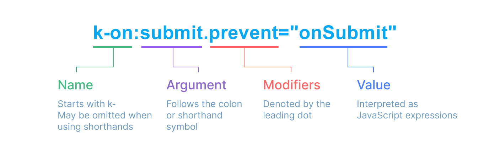

# Template Syntax

Kdu uses an HTML-based template syntax that allows you to declaratively bind the rendered DOM to the underlying component instance's data. All Kdu templates are syntactically valid HTML that can be parsed by spec-compliant browsers and HTML parsers.

Under the hood, Kdu compiles the templates into highly-optimized JavaScript code. Combined with the reactivity system, Kdu is able to intelligently figure out the minimal number of components to re-render and apply the minimal amount of DOM manipulations when the app state changes.

If you are familiar with Virtual DOM concepts and prefer the raw power of JavaScript, you can also [directly write render functions](/guide/extras/render-function.html) instead of templates, with optional JSX support. However, do note that they do not enjoy the same level of compile-time optimizations as templates.

## Text Interpolation

The most basic form of data binding is text interpolation using the "Mustache" syntax (double curly braces):

```kdu-html
<span>Message: {{ msg }}</span>
```

The mustache tag will be replaced with the value of the `msg` property from the corresponding component instance. It will also be updated whenever the `msg` property changes.

## Raw HTML

The double mustaches interpret the data as plain text, not HTML. In order to output real HTML, you will need to use the [`k-html` directive](/api/built-in-directives.html#k-html):

```kdu-html
<p>Using text interpolation: {{ rawHtml }}</p>
<p>Using k-html directive: <span k-html="rawHtml"></span></p>
```

<script setup>
  const rawHtml = '<span style="color: red">This should be red.</span>'
</script>

<div class="demo">
  <p>Using text interpolation: {{ rawHtml }}</p>
  <p>Using k-html directive: <span k-html="rawHtml"></span></p>
</div>

Here we're encountering something new. The `k-html` attribute you're seeing is called a **directive**. Directives are prefixed with `k-` to indicate that they are special attributes provided by Kdu, and as you may have guessed, they apply special reactive behavior to the rendered DOM. Here, we're basically saying "keep this element's inner HTML up-to-date with the `rawHtml` property on the current active instance."

The contents of the `span` will be replaced with the value of the `rawHtml` property, interpreted as plain HTML - data bindings are ignored. Note that you cannot use `k-html` to compose template partials, because Kdu is not a string-based templating engine. Instead, components are preferred as the fundamental unit for UI reuse and composition.

:::warning Security Warning
Dynamically rendering arbitrary HTML on your website can be very dangerous because it can easily lead to [XSS vulnerabilities](https://en.wikipedia.org/wiki/Cross-site_scripting). Only use `k-html` on trusted content and **never** on user-provided content.
:::

## Attribute Bindings

Mustaches cannot be used inside HTML attributes. Instead, use a [`k-bind` directive](/api/built-in-directives.html#k-bind):

```kdu-html
<div k-bind:id="dynamicId"></div>
```

The `k-bind` directive instructs Kdu to keep the element's `id` attribute in sync with the component's `dynamicId` property. If the bound value is `null` or `undefined`, then the attribute will be removed from the rendered element.

### Shorthand

Because `k-bind` is so commonly used, it has a dedicated shorthand syntax:

```kdu-html
<div :id="dynamicId"></div>
```

Attributes that start with `:` may look a bit different from normal HTML, but it is in fact a valid character for attribute names and all Kdu-supported browsers can parse it correctly. In addition, they do not appear in the final rendered markup. The shorthand syntax is optional, but you will likely appreciate it when you learn more about its usage later.

> For the rest of the guide, we will be using the shorthand syntax in code examples, as that's the most common usage for Kdu developers.

### Boolean Attributes

[Boolean attributes](https://html.spec.whatwg.org/multipage/common-microsyntaxes.html#boolean-attributes) are attributes that can indicate true / false values by its presence on an element. For example, [`disabled`](https://developer.mozilla.org/en-US/docs/Web/HTML/Attributes/disabled) is one of the most commonly used boolean attributes.

`k-bind` works a bit differently in this case:

```kdu-html
<button :disabled="isButtonDisabled">Button</button>
```

The `disabled` attribute will be included if `isButtonDisabled` has a [truthy value](https://developer.mozilla.org/en-US/docs/Glossary/Truthy). It will also be included if the value is an empty string, maintaining consistency with `<button disabled="">`. For other [falsy values](https://developer.mozilla.org/en-US/docs/Glossary/Falsy) the attribute will be omitted.

### Dynamically Binding Multiple Attributes

If you have a JavaScript object representing multiple attributes that looks like this:

<div class="composition-api">

```js
const objectOfAttrs = {
  id: 'container',
  class: 'wrapper'
}
```

</div>
<div class="options-api">

```js
data() {
  return {
    objectOfAttrs: {
      id: 'container',
      class: 'wrapper'
    }
  }
}
```

</div>

You can bind them to a single element by using `k-bind` without an argument:

```kdu-html
<div k-bind="objectOfAttrs"></div>
```

## Using JavaScript Expressions

So far we've only been binding to simple property keys in our templates. But Kdu actually supports the full power of JavaScript expressions inside all data bindings:

```kdu-html
{{ number + 1 }}

{{ ok ? 'YES' : 'NO' }}

{{ message.split('').reverse().join('') }}

<div :id="`list-${id}`"></div>
```

These expressions will be evaluated as JavaScript in the data scope of the current component instance.

In Kdu templates, JavaScript expressions can be used in the following positions:

- Inside text interpolations (mustaches)
- In the attribute value of any Kdu directives (special attributes that start with `k-`)

### Expressions Only

Each binding can only contain **one single expression**. An expression is a piece of code that can evaluate to a value. A simple check is whether it can be used after `return`.

Therefore, the following will **NOT** work:

```kdu-html
<!-- this is a statement, not an expression: -->
{{ var a = 1 }}

<!-- flow control won't work either, use ternary expressions -->
{{ if (ok) { return message } }}
```

### Calling Functions

It is possible to call a component-exposed method inside a binding expression:

```kdu-html
<span :title="toTitleDate(date)">
  {{ formatDate(date) }}
</span>
```

:::tip
Functions called inside binding expressions will be called every time the component updates, so they should **not** have any side effects, such as changing data or triggering asynchronous operations.
:::

### Restricted Globals Access

Template expressions are sandboxed and only have access to a `restricted list of globals`. The list exposes commonly used built-in globals such as `Math` and `Date`.

Globals not explicitly included in the list, for example user-attached properties on `window`, will not be accessible in template expressions. You can, however, explicitly define additional globals for all Jdy expressions by adding them to [`app.config.globalProperties`](/api/application.html#app-config-globalproperties).

## Directives

Directives are special attributes with the `k-` prefix. Jdy provides a number of [built-in directives](/api/built-in-directives.html), including `k-html` and `k-bind` which we have introduced above.

Directive attribute values are expected to be single JavaScript expressions (with the exception of `k-for`, `k-on` and `k-slot`, which will be discussed in their respective sections later). A directive's job is to reactively apply updates to the DOM when the value of its expression changes. Take [`k-if`](/api/built-in-directives.html#k-if) as an example:

```kdu-html
<p k-if="seen">Now you see me</p>
```

Here, the `k-if` directive would remove / insert the `<p>` element based on the truthiness of the value of the expression `seen`.

### Arguments

Some directives can take an "argument", denoted by a colon after the directive name. For example, the `k-bind` directive is used to reactively update an HTML attribute:

```kdu-html
<a k-bind:href="url"> ... </a>

<!-- shorthand -->
<a :href="url"> ... </a>
```

Here `href` is the argument, which tells the `k-bind` directive to bind the element's `href` attribute to the value of the expression `url`. In the shorthand, everything before the argument (i.e. `k-bind:`) is condensed into a single character, `:`.

Another example is the `k-on` directive, which listens to DOM events:

```kdu-html
<a k-on:click="doSomething"> ... </a>

<!-- shorthand -->
<a @click="doSomething"> ... </a>
```

Here the argument is the event name to listen to: `click`. `k-on` has a corresponding shorthand, namely the `@` character. We will talk about event handling in more detail too.

### Dynamic Arguments

It is also possible to use a JavaScript expression in a directive argument by wrapping it with square brackets:

```kdu-html
<!--
Note that there are some constraints to the argument expression,
as explained in the "Dynamic Argument Value Constraints" and "Dynamic Argument Syntax Constraints" sections below.
-->
<a k-bind:[attributeName]="url"> ... </a>

<!-- shorthand -->
<a :[attributeName]="url"> ... </a>
```

Here `attributeName` will be dynamically evaluated as a JavaScript expression, and its evaluated value will be used as the final value for the argument. For example, if your component instance has a data property, `attributeName`, whose value is `"href"`, then this binding will be equivalent to `k-bind:href`.

Similarly, you can use dynamic arguments to bind a handler to a dynamic event name:

```kdu-html
<a k-on:[eventName]="doSomething"> ... </a>

<!-- shorthand -->
<a @[eventName]="doSomething">
```

In this example, when `eventName`'s value is `"focus"`, `k-on:[eventName]` will be equivalent to `k-on:focus`.

#### Dynamic Argument Value Constraints

Dynamic arguments are expected to evaluate to a string, with the exception of `null`. The special value `null` can be used to explicitly remove the binding. Any other non-string value will trigger a warning.

#### Dynamic Argument Syntax Constraints

Dynamic argument expressions have some syntax constraints because certain characters, such as spaces and quotes, are invalid inside HTML attribute names. For example, the following is invalid:

```kdu-html
<!-- This will trigger a compiler warning. -->
<a :['foo' + bar]="value"> ... </a>
```

If you need to pass a complex dynamic argument, it's probably better to use a [computed property](./computed.html), which we will cover shortly.

When using in-DOM templates (templates directly written in an HTML file), you should also avoid naming keys with uppercase characters, as browsers will coerce attribute names into lowercase:

```kdu-html
<a :[someAttr]="value"> ... </a>
```

The above will be converted to `:[someattr]` in in-DOM templates. If your component has a `someAttr` property instead of `someattr`, your code won't work. Templates inside Single-File Components are **not** subject to this constraint.

### Modifiers

Modifiers are special postfixes denoted by a dot, which indicate that a directive should be bound in some special way. For example, the `.prevent` modifier tells the `k-on` directive to call `event.preventDefault()` on the triggered event:

```kdu-html
<form @submit.prevent="onSubmit">...</form>
```

You'll see other examples of modifiers later, [for `k-on`](./event-handling.html#event-modifiers) and [for `k-model`](./forms.html#modifiers), when we explore those features.

And finally, here's the full directive syntax visualized:


